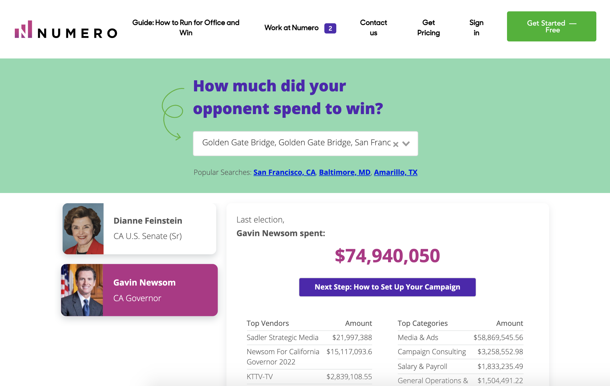

# Campaign-Calculator

Cleaning, wrangling, and analyzing data from 50 states to obtain expenditure summaries for 4,500+ candidates in federal and state office. Statistics presented by Numero, a political tech startup providing an all-in-one toolkit for Democratic campaign fundraisers.

